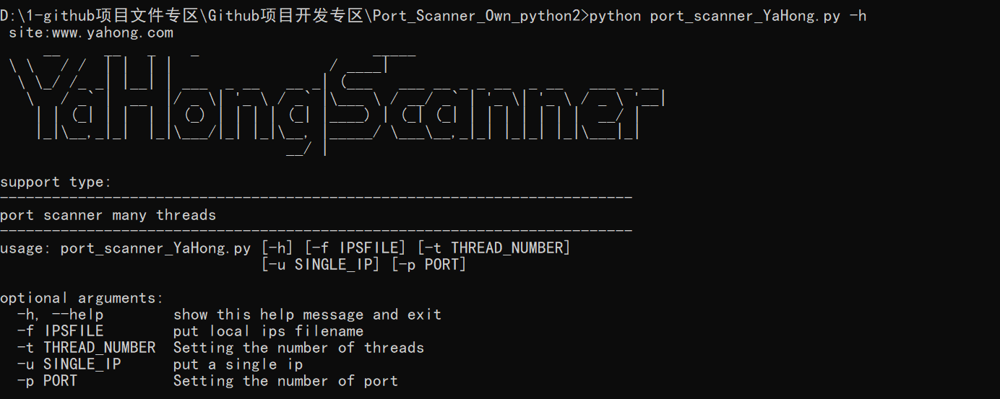

# Port_Scanner_Own_python2

基于python2开发的多线程端口扫描工具，可自定义输出结果，高速轻量

用法介绍： 
support type:    
------------------------------------------------------------------------- 
port scanner many threads 
------------------------------------------------------------------------- 

usage: port_scanner_YaHong.py [-h] [-f IPSFILE] [-t THREAD_NUMBER] 
                               [-u SINGLE_IP] [-p PORT] 
                              

optional arguments: 
  -h, --help        show this help message and exit    显示帮助信息 
  -f IPSFILE        put local ips filename      指定文件批量扫描 
  -t THREAD_NUMBER  Setting the number of threads   设置线程数，默认是50 
  -u SINGLE_IP      put a single ip    指定单独IP扫描 
  -p PORT           Setting the number of port     对指定端口进行扫描 

如有问题，请联系作者：1147893217@qq.com   笔名：慕风
